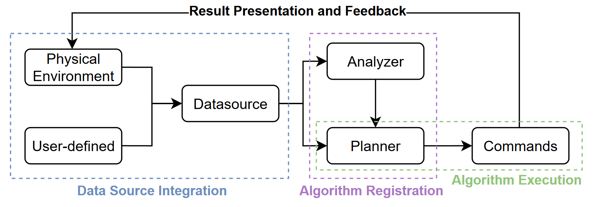
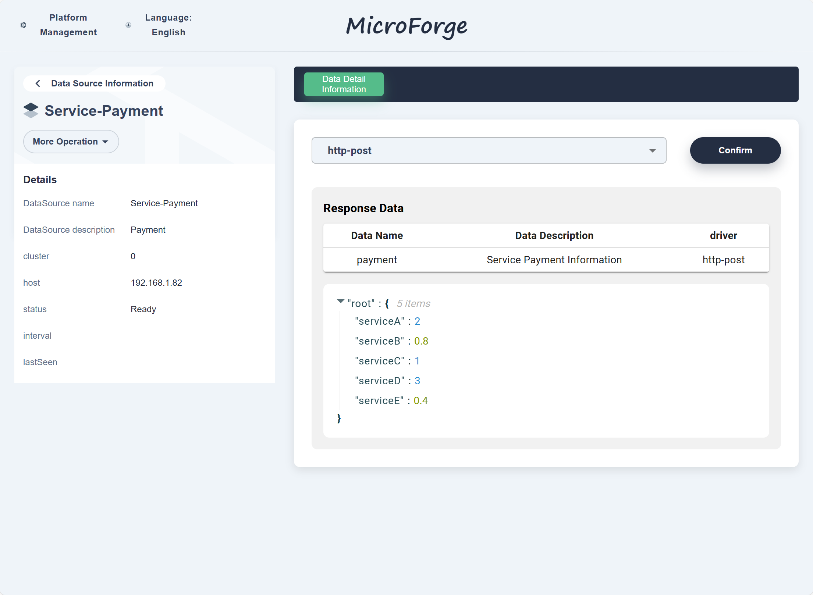
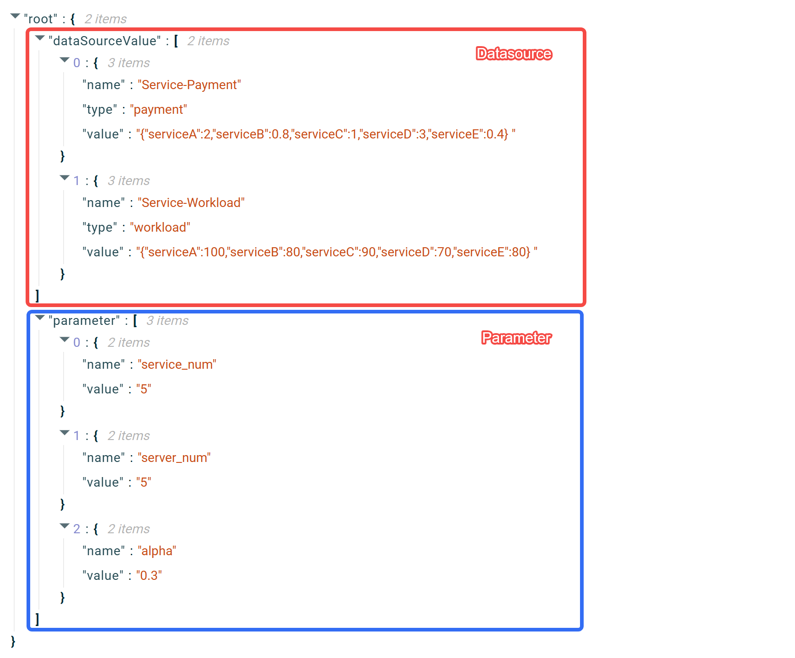
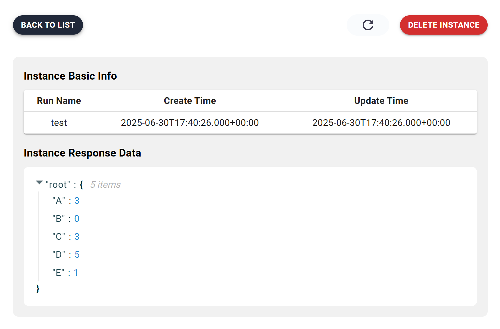

# Case Study

this section presents a case study based on established microservice research methodology. The experiment demonstrates the interactions between users, data sources, and algorithms, as well as how the platform facilitates efficient and semi-automated experimental cycles
* X. Li, L. Pan, S. Liu, and X. Meng, “A fair and efficient resource allocation algorithm for cloud rendering jobs,” IEEE Transactions on Services Computing, pp. 1–12, 2025.



## Data Source Integration

Users can import existing data from physical or user environments through standardized interfaces, or define and register new data sources based on specific experimental requirements. This flexible mechanism ensures a wide range of data input options. As shown below, a user-defined data source is demonstrated, where payment information for each service is defined to calculate fairness metrics for each service.



## Algorithm Registration

Users packaged and registered algorithms on the platform. The algorithms were categorized into two types: analysis algorithms for feature extraction and system understanding, and planning algorithms for decision-making and strategy generation. The platform demonstrated support for modular and API-based integration. As shown blow, a code packaging example is presented. Notably, users were not required to modify their existing algorithm implementations; they only needed to incorporate lightweight web service interfaces to enable platform integration.

```python
@app.route( rule:"/algorithm1', methods=['POST'])
def evaluate 1():
    #Receive JSON data from the reguest
    # The first data source is the task list, which comes from the analysis algorithm
    # The second data source is the server list.
    jobs = json.loads(request.get_json()['dataSourceValue'][0]['value']
    servers = json.loads(request.get_json()['dataSourceValue'][1]['value']
    #Extract the algorithm parameters from the request
    # which are generally the configuration or constraints reguired by the algorithm.parameter =request.get json()['parameter']
    # Call the specific algorithm logic
    allocation_1 = algorithm_1(servers, jobs, parameter)
    return allocation_1
```

## Algorithm Execution

After algorithms are successfully registered, users can execute them within the platform through a configurable and standardized interface. The platform automatically obtains the required data sources based on user-defined configurations. The collected data is shown blow, which includes data from the data sources and the basic parameters required by the algorithm. The platform calls the algorithm and passes structured inputs for execution. After the algorithm computation is completed, the platform systematically records the results and stores them in an accessible and queryable format.



## Result Presentation and Feedback

The final results are displayed through the platform interface.



Additionally, the results can be fed back into the system to support performance evaluation, optimization, and iterative experimentation. For instance, based on the deployment plan generated by the algorithm, the service deployment structure can be modified and service performance can be subsequently tested to validate the algorithm's effectiveness. The algorithm results can also be translated into the input format required by the executor, enabling automated execution. Furthermore, user-defined execution methods can be integrated into the executor according to the configuration illustrated below.

```yaml
# Name of the request configuration
name: test
# HTTP method to use; must be uppercase (e.g., GET, POST, PUT, DELETE)
method: POST
# Protocol used for the request; must be uppercase (e.g., HTTP Or HTTPS)
protocoL: HTTP
# Target host Ip or domain name
host: 192.168.1.104
# Port number on the host to connect to
port: 31141
# Endpoint path on the server
path: /add-source
# Specifies how parameters are passed; body' means in the request payload
param_mode: body
# Parameters section
params:
    body:
        # Format of the request body; "json' indicates JsoN payload
        type: json
        # Keys and their validation rules for the JSoN body
        keys:
            cluster:
            # Allowed data types for this key
            key_types:
                - int
            # Whether this key is required in the request
            key_required: True
        name:
            key_types:
                - string
            key_required:True
        interval:
            key_types:
                - int
            key_required: True
```