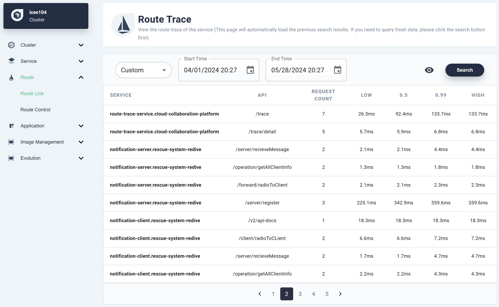
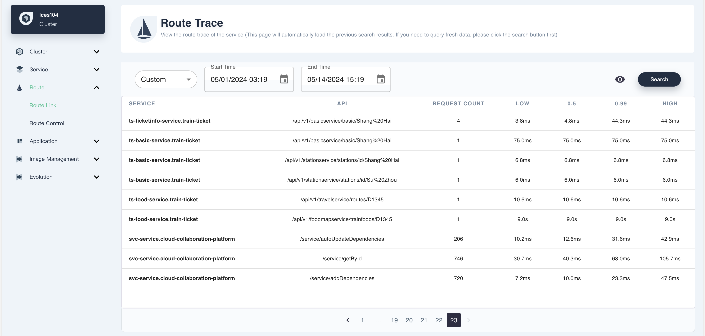
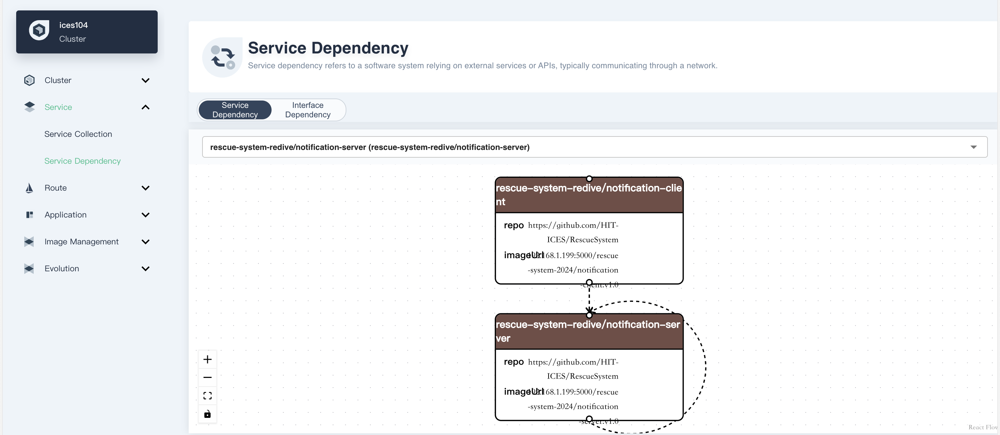
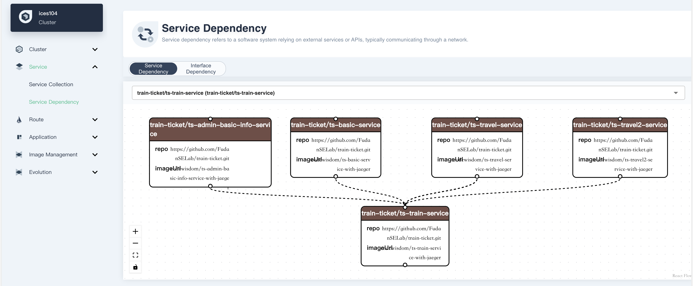
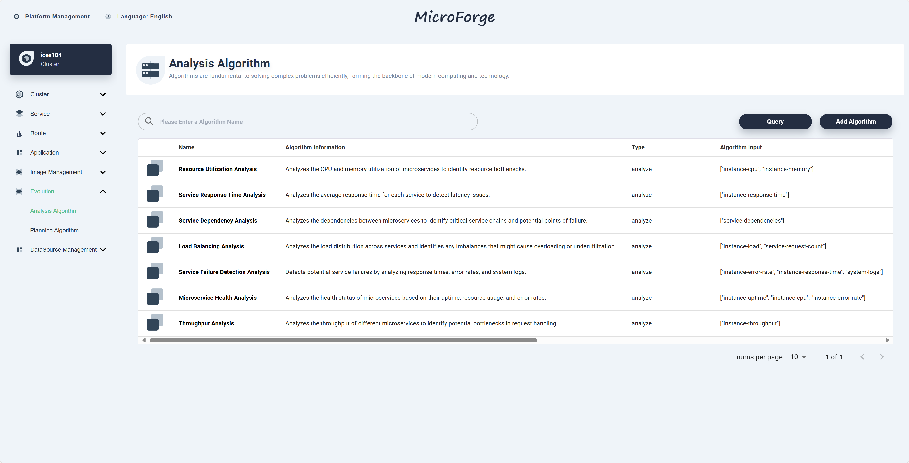
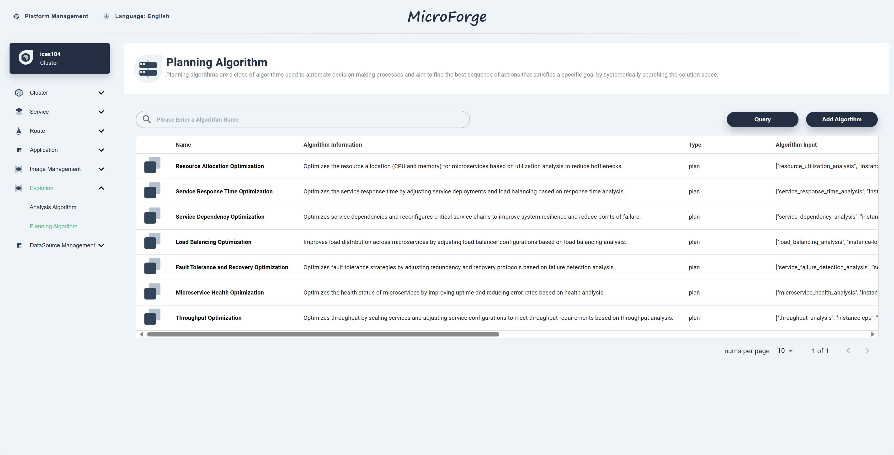
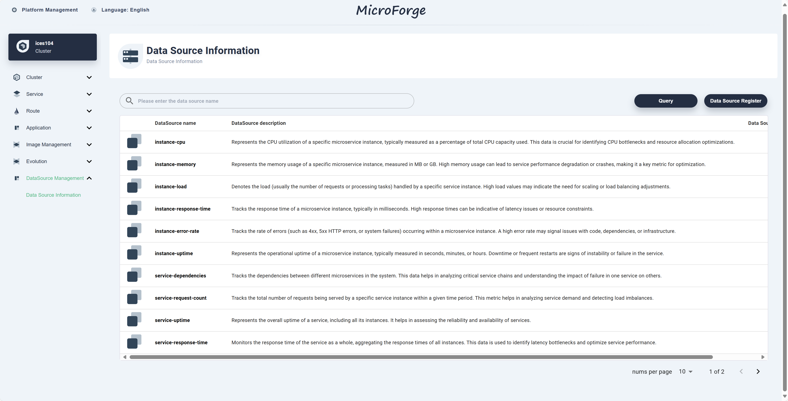
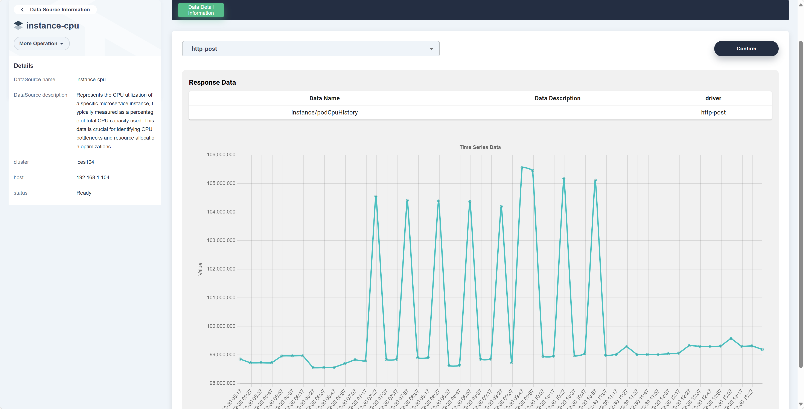

# MicroForge Functional Validation

The RescueService services were deployed using [general template files](https://github.com/HIT-ICES/RescueSystem/tree/main/shared) from our repository, while Train Ticket services utilized [their official Kubernetes configuration files](https://github.com/FudanSELab/train-ticket/tree/master/deployment).

After deployment, user activity was simulated by sending continuous requests to the system services with stress measure compoment. The testing period lasted approximately twenty minutes, during which interfaces in RescueService received ten repeated requests, while Train Ticket interfaces received 330 repeated requests, all using predefined request data. The results for RescueService and Train Ticket are shown below.

## Request Recording Results

### Rquest Recording Results of RescueService

### Rquest Recording Results of TrainTicket

## Comparison of Trace Result

### Comparison of Trace Result in MicroForge with Actual Trace of RescueService

### Comparison of Trace Result in MicroForge with Actual Trace of Train Ticket

## Dependency Analysis Results

### Part of the dependency analysis results of RescueService

### Part of the dependency analysis results of TrainTicket

## Stress Measure

## Management and execution of Analysis and Planning algorithms

Regarding the management and execution of Analysis and Planning algorithms, several methods were implemented and registered several methods in the system, including Resource Allocation Analysis and Optimization. Each method requires specific input parameters from various platform data sources and generates outputs such as prediction results, confidence scores, and execution times. The interface displays these details, including algorithm names, descriptions, and input/output parameter types. For instance, Resource Allocation Analysis evaluates resource allocation efficiency by analyzing CPU and memory usage data from instances. The algorithm list interface presents basic information about all registered algorithms and serves as an intuitive management portal.

### Analysis Algorithm Managament

### Plan Algorithm Management

## Data Source

