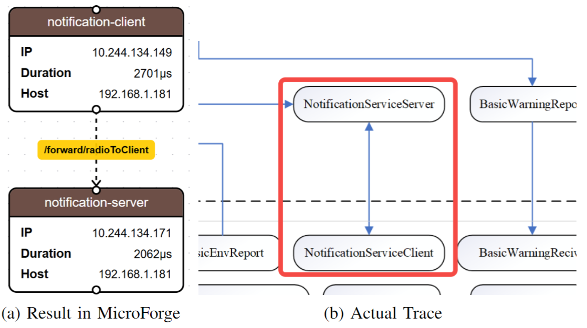
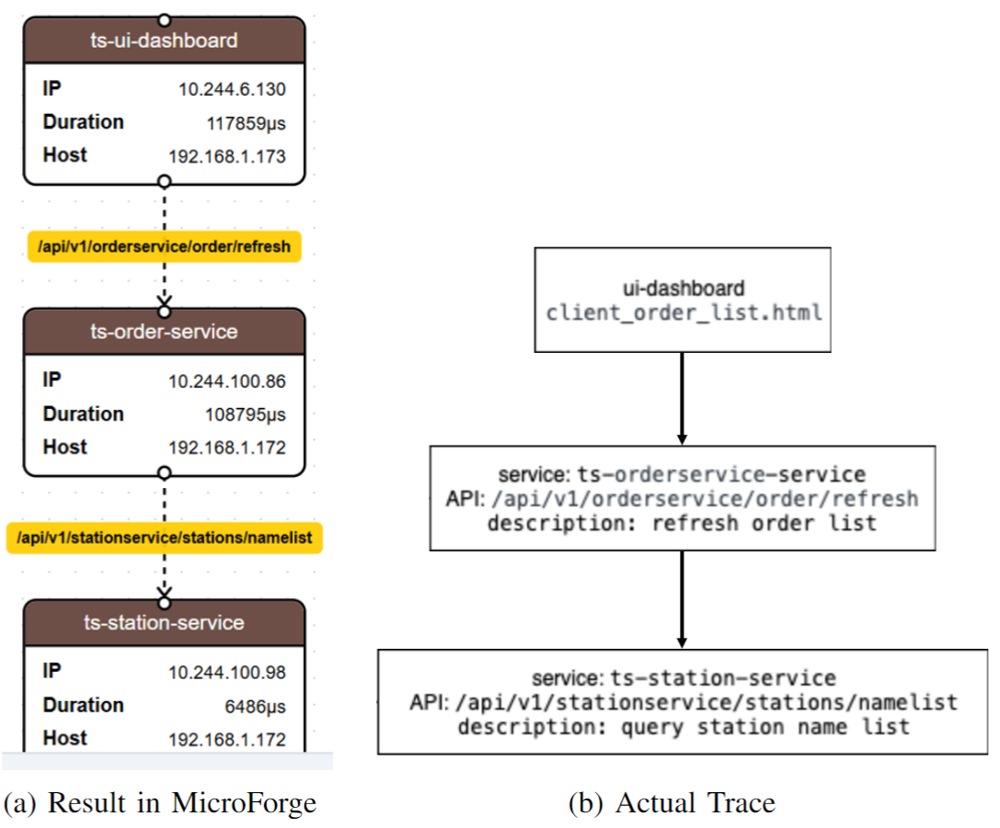

# MicroForge Functional Validation

The RescueService services were deployed using [general template files](https://github.com/HIT-ICES/RescueSystem/tree/main/shared) from our repository, while Train Ticket services utilized [their official Kubernetes configuration files](https://github.com/FudanSELab/train-ticket/tree/master/deployment).

After deployment, user activity was simulated by sending continuous requests to the system services with stress measure compoment. The testing period lasted approximately twenty minutes, during which interfaces in RescueService received ten repeated requests, while Train Ticket interfaces received 330 repeated requests, all using predefined request data. The results for RescueService and Train Ticket are shown below.

## Request Recording Results

### Rquest Recording Results of RescueService

### Rquest Recording Results of TrainTicket

## Comparison of Trace Result

Using the collected request data, the platform analyzed and visualized the request processing chains for each API. Below illustrates these results, showing detailed request processing chains for two specific interfaces: `/server/receiveMessage` interface and `/api/v1/orderservice/order/refresh`[Please visit](https://github.com/FudanSELab/train-ticket/blob/master/image/train-ticket-draws-Order-Query.png) interface in RescueService and Train Ticket, respectively.  The left side of the figure shows the real dependency structure of the microservice system, and the right side shows the dependency structure of the proposed platform, which can be found to be consistent. The results show that the platform captured comprehensive processing details for both interfaces, including request timing data (start time and duration), container information (IP addresses and host locations), and the complete request chain information with processing time for each node in the chain and their interface specifications.

### Comparison of Trace Result in MicroForge with Actual Trace of RescueService

### Comparison of Trace Result in MicroForge with Actual Trace of Train Ticket

## Dependency Analysis Results

The platform aggregates all API requests to automatically construct and analyze service dependency graphs, as shown below. The analysis reveals two distinct dependency patterns: the self-request dependency of the notification-server in RescueService and the multiple-service dependency pattern of ts-train-service in Train Ticket.

### Part of the dependency analysis results of RescueService

### Part of the dependency analysis results of TrainTicket

## Stress Measure

For the stress measure capability, users can simulate high traffic loads and extreme conditions beyond normal operating parameters to assess system behavior, which identifies performance bottlenecks and areas requiring optimization. Tests were conducted on five randomly selected interfaces from both Train Ticket and RescueService. The tests involved 10 to 50 users making requests every 3 seconds over a 5 minute period. Below presents the results, showing an aggregated report of performance under varying user loads and graphs illustrating performance changes as user numbers increase.

### Stress Measure of RescureServcie

### Stress Measure of TrainTicket

## Management and execution of algorithms

Regarding the management and execution of Analysis and Planning algorithms, several methods were implemented and registered several methods in the system, including Resource Allocation Analysis and Optimization. Each method requires specific input parameters from various platform data sources and generates outputs such as prediction results, confidence scores, and execution times. The interface displays these details, including algorithm names, descriptions, and input/output parameter types. For instance, Resource Allocation Analysis evaluates resource allocation efficiency by analyzing CPU and memory usage data from instances. The algorithm list interface presents basic information about all registered algorithms and serves as an intuitive management portal.

### Analysis Algorithm Managament

### Plan Algorithm Management

## Analyse & Plan Algorithm Execution Results

the Resource Allocation Analysis and Optimization algorithm was applied to evaluate instance resource allocation across three scenarios. While these scenarios used identical service instances with the same initial resource allocation, they differed in their user request patterns, resulting in varying resource utilization rates across instances. The analysis algorithm evaluated resource usage based on historical data to identify if containers needed resource adjustments, while the planning algorithm determined the specific adjustments required. As shown in below, users can view analysis results for different requests, including input parameters such as instance ID and resource usage time range, along with output results showing CPU and memory usage metrics and bottleneck identification. Below displays the planning algorithm results and provides an aggregated report feature that clearly demonstrates algorithm performance changes across different scenarios.

### Detail and Execution Result of Analyse Algorithm

### Detail and Execution Result of Plan algorithm

## Data Source

Different types of monitoring data collected during Train Ticket and RescureService experiments were registered using the data source APIs. The platform successfully integrated various data sources including instance metrics and performance data, making them accessible through a unified interface. To verify data retrieval capabilities, specific instance metrics such as CPU usage over time were examined. The results show that registered data sources were properly maintained and could be effectively accessed by analysis and planning algorithms for subsequent processing.

